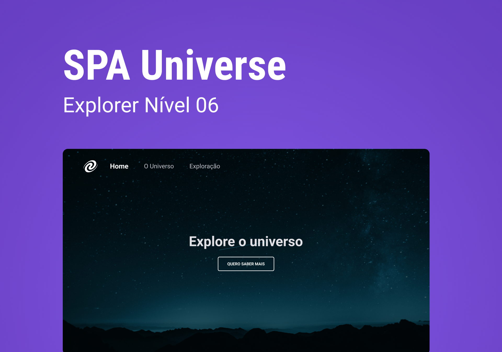

<h1 align="center"> SPA Universe </h1>

  <a href="#-tecnologias">Tecnologias</a>&nbsp;&nbsp;&nbsp;|&nbsp;&nbsp;&nbsp;
  <a href="#-projeto">Projeto</a>&nbsp;&nbsp;&nbsp;|&nbsp;&nbsp;&nbsp;
  <a href="#-layout">Layout</a>&nbsp;&nbsp;&nbsp;|&nbsp;&nbsp;&nbsp;
  <a href="#memo-licença">Licença</a>

  

 

  

## 🚀 Tecnologias

Esse projeto foi desenvolvido com as seguintes tecnologias:

- HTML e CSS
- JavaScript
- Git e Github
- Figma

## 💻 Projeto

O SPA Universe é um projeto que mostra :
- Conceitos de SPA;
- Mapeamento de rotas;
- Assíncrono e promises;
- Orientação a objetos;
- Classes e muito mais.

## 🔖 Layout

Você pode visualizar o layout do projeto através [DESSE LINK]https://www.figma.com/design/QoUl2zuc6mzdFiPtMeb82v/%5BDesafios-Explorer%5D-SPA-Universe-(Copy)?node-id=35-78&node-type=FRAME&m=dev. É necessário ter conta no [Figma](https://figma.com) para acessá-lo.

## :memo: Licença

Esse projeto está sob a licença MIT.

---

